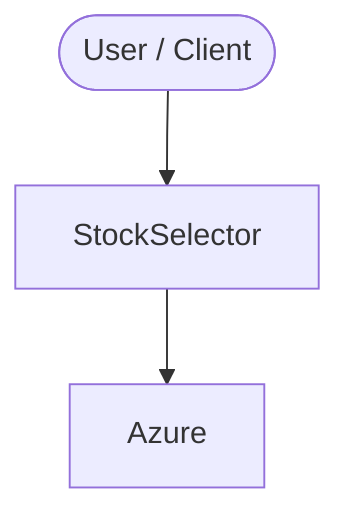

Stock Selector 
==============
This project will work on the principle of EMH .[ EFFICIENT MARKET HYPOTHESIS - EMH ] . You can beat the market only on academic research. This program will help you find the best security to invest in based on market price , alpha and beta.

<!-- ARCH-DIAGRAM:START -->

## Architecture

> Auto-generated architecture diagram. See [`docs/context-map.md`](docs/context-map.md) for the full context map (core application, containers/cloud, and database connections).

<!-- ARCH-DIAGRAM:END -->
