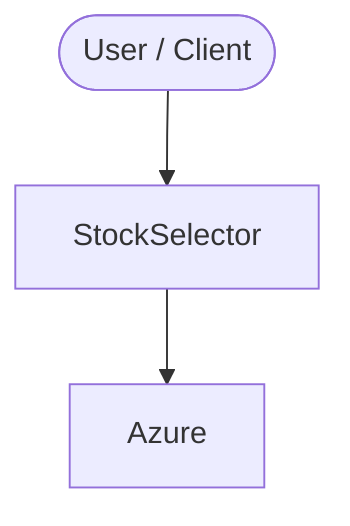

# Context Map — `StockSelector`

> Auto-generated architecture & deployment context map. Summarizes the core application, container/cloud footprint, and database connections. Regenerate after significant structural changes.

**Repo:** `avnit/StockSelector` · **Original** · Public · Primary language: Groovy · Default branch: `master` · Files: 68

**Description:** This project will work on the principle of EMH .[ EFFICIENT MARKET HYPOTHESIS - EMH ] .

## 1. Core application

Stock Selector

## 2. Containers & cloud applications

**Cloud deploy / serverless manifests:**
- `azure-pipelines.yml`

**Detected cloud platforms / services:** Azure

## 3. Database connections

_No database drivers or connection strings detected._

## 4. Architecture diagram

## 5. Security posture

- No open Dependabot alerts or static-scan findings recorded.

---
_Generated by repo context-mapping pass on 2026-08-13._